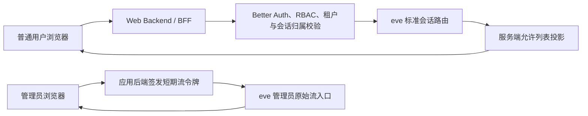

# P0：技术与安全边界

> 文件名：`docs/P0-技术与安全边界.md`  
> 状态：已定稿  
> 定稿日期：2026-07-29

## 1. 目的与范围

本文件是 P0 阶段的权威设计边界，用于约束 P1 及后续阶段的实现。P0 仅定稿技术方案、信任边界、身份与权限、会话归属、事件可见性、凭据与文件安全等原则，不在本阶段实现完整业务功能。

## 2. 技术方案与部署边界

- Web：Next.js + `eve/next` + `eve/react`
- 数据库：PostgreSQL
- ORM：Drizzle
- 认证：Better Auth `1.6.25` + Drizzle Adapter，使用 PostgreSQL 数据库会话；密码哈希使用 `@node-rs/argon2` `2.0.2` 的 Argon2id
- 文件存储：S3 兼容对象存储
- 部署：单实例、自托管、Web/BFF 与 eve 同源部署
- 持久化：PostgreSQL 和 S3 作为独立服务；项目数据目录可使用项目根目录下的 `.data`，容器部署时必须将其挂载为持久卷
- 扩展边界：不支持、不预留应用多副本并行运行方案

项目数据目录至少保存 eve 本地工作流数据、提供商凭据主密钥、Better Auth 认证密钥和独立的 JWT 签名密钥。三类密钥必须相互独立。运行时必须确保该目录不被公开访问且不纳入 Git。

- WSL 开发环境可继续使用项目根目录下的 `.data`。Windows 挂载上无法可靠呈现 Unix 权限作为已知开发环境例外，不构成阶段开发阻塞。
- 纯 Linux 生产环境允许使用项目根目录下的 `.data`，例如 `/opt/baigong-agent/.data`。`BAIGONG_DATA_DIR` 必须配置为 Linux 原生文件系统上的绝对路径。
- 生产数据目录权限为 `0700`，密钥文件权限为 `0600`，并由应用运行用户独占。该目录不得位于 Web 静态目录，部署、升级和清理流程不得删除它。
- 生产部署验收必须确认该目录不可通过 Web 访问、不进入 Git、应用重启和升级后仍持久化，且其他系统用户无法读取。
- `BAIGONG_APP_ORIGIN` 是应用的唯一公开 Origin，用于 Better Auth Base URL 与同源写操作校验。生产必须配置精确的 HTTPS Origin；仅本机 `localhost`、`127.0.0.1` 或 `[::1]` 可作为生产模式本地验收的 HTTP 例外。
- 部署在反向代理后时，代理必须删除客户端传入的 `X-Real-IP` 并以实际来源地址重写它；应用不信任 `X-Forwarded-For`。应用监听端口不得绕过该受信代理直接暴露给公网。

## 3. 租户、身份与角色

### 3.1 租户边界

首版仅运行一个默认租户，不提供租户管理界面，但数据模型从开始建立 `tenant_id` 边界。用户、会话、文件、记忆、模型配置、凭据和审计记录均归属租户。所有租户和用户身份均来自已验证的服务端身份上下文，不接受 Prompt、Tool 参数或请求体声明的内部 ID 作为授权依据。

### 3.2 固定角色

首版仅定义两种固定角色，不实现自定义角色编辑器。权限矩阵必须在服务端集中定义。

| 能力 | `USER` | `ADMIN` |
| --- | --- | --- |
| 访问自己的会话、文件、记忆和个人设置 | 允许 | 允许 |
| 接收普通用户安全事件投影 | 允许 | 允许 |
| 管理本租户用户和系统配置 | 禁止 | 允许 |
| 查看本租户用户的完整会话和 eve 原始事件 | 禁止 | 允许 |
| 取消本租户用户正在执行的 Turn | 禁止 | 允许 |
| 以其他用户身份继续对话、修改历史或伪装发言 | 禁止 | 禁止 |

管理员权限仍受租户边界限制。管理员查看他人会话、签发原始流令牌或取消他人任务时必须记录审计。

## 4. 账户、登录与会话撤销

- 本地普通用户和管理员共用一个登录入口，使用用户名或邮箱加密码登录；页面不允许用户选择或声明角色。
- 每个本地账号必须同时配置唯一用户名和唯一邮箱，两者均规范化为小写后保存和比较。
- Better Auth 负责本地凭据、Cookie 和数据库会话生命周期；应用身份与授权层负责租户、固定角色、账号状态、首次改密和身份来源。
- 密码通过 Better Auth 自定义密码接口使用 `Argon2id` 哈希，不使用其默认密码算法。
- 不开放自助注册；用户由管理员创建、禁用和重置密码。
- 初始管理员通过 `npm run admin:bootstrap` 一次性交互式命令创建。命令要求输入用户名、邮箱和显示名称，生成仅显示一次的随机临时密码；密码不得通过命令参数或环境变量传入，不保留任何默认账号资料或默认密码。存在有效本地管理员时命令必须失败关闭。
- 管理员创建或重置用户时生成一次性临时密码，仅显示一次；用户首次登录后必须修改。
- 密码至少 12 个字符，不强制大小写、数字和符号组合。
- 本地登录使用 HttpOnly Cookie 承载 Better Auth 数据库会话。会话采用 7 天滚动有效期，持续使用可持续续期，不设绝对最长时限。
- Better Auth 认证密钥在项目数据目录首次使用时自动生成并持久化，不存入数据库，不通过环境变量配置，并与提供商凭据 AES 主密钥和管理员流 JWT 签名密钥分离。
- 用户被禁用、密码被重置或角色变更时，立即撤销其全部现有会话。
- 敏感管理操作每次重新读取数据库中的当前角色和账户状态，不仅依赖登录时缓存的权限。
- 本地登录在开发和生产环境均启用 PostgreSQL 限流。同一来源对登录端点最多请求 3 次/10 秒；同一用户名或邮箱在 15 分钟内连续失败 10 次后限制该标识继续尝试 15 分钟。成功登录清除该标识的失败计数。
- 登录失败统一返回不暴露账号存在性、禁用状态或内部限流原因的错误；登录成功、失败和触发限制均记录审计，且不得记录密码。
- 允许同一用户持有多个本地会话。管理员可撤销指定用户的全部会话；首版不限制并发设备数量。
- P2 提供最小用户管理页面和接口：管理员可查看本地及嵌入用户，创建本地 `USER` 或 `ADMIN`、生成临时密码、启用或禁用账号、变更本地角色、重置密码和撤销全部会话，并查看身份来源、状态、角色和最后登录时间。
- 用户记录首版不提供硬删除。系统必须防止禁用或降级最后一个有效本地管理员，所有用户管理操作均记录审计。

## 5. 对话主链路与 eve 访问凭据

### 5.1 普通用户链路

会话创建、继续、取消、历史查询和安全事件流均经过 BFF。BFF 必须在每次操作前验证 Better Auth 数据库会话或受控嵌入会话、租户、角色和会话归属。普通用户的流式返回使用同源 NDJSON，每个安全事件携带单调递增游标，支持断线后从最后游标恢复。

本地用户的创建、继续和取消请求使用 Better Auth 会话 Cookie，并执行同源校验和 CSRF 防护。嵌入用户使用仅保存在 iframe 运行内存中的 Bearer 会话令牌，并执行嵌入客户端、允许来源域和身份来源校验。

### 5.2 管理员原始事件链路

管理员原始事件不经过 BFF 投影或转发。eve 提供专用 `GET /eve/v1/admin/stream` 入口，验证短期管理员流令牌后，根据应用 `conversationId` 在服务端解析对应 eve 会话，并将持久原始事件流原样返回浏览器。`startIndex` 作为断线续传游标。

管理员会话创建、继续、取消和历史查询仍经过应用后端。只有实时原始事件读取直接连接 eve。

### 5.3 两类短期 JWT

- BFF 服务令牌：只能由服务端访问 eve 标准会话路由，不得返回浏览器。
- 管理员流令牌：绑定 `admin_id`、`tenant_id`、`conversation_id`、用途和过期时间，仅允许读取指定会话的管理员原始流。
- 管理员流令牌默认有效期为 60 秒，仅限制建立或重连的时间，不因令牌到期中断已建立的流。
- 断线重连时，应用后端重新验证管理员身份和会话租户后签发新令牌。
- 令牌使用 `Authorization: Bearer` 传递，不放入 URL。
- JWT 签名密钥在项目数据目录自动生成并持久化，与提供商凭据 AES 主密钥分离。

eve 的标准会话路由和 `/eve/v1/info` 不允许普通浏览器身份访问。生产环境必须移除 `localDev()` 和 `placeholderAuth()` 的浏览器放行可能，所有路由默认失败关闭。

## 6. 会话句柄、归属与持久化

- 浏览器仅使用应用生成的不可预测 `conversationId`。
- PostgreSQL 保存 `conversationId` 与 eve `sessionId` 的服务端映射。
- eve `continuationToken` 作为服务端凭据，使用本地 AES 主密钥加密后存入 PostgreSQL，并在每次 `session.waiting` 后更新。
- 普通用户不得获得 eve `sessionId` 或 `continuationToken`。管理员业务接口和原始流 URL 不主动返回这些句柄，但未经处理的 eve 原始事件本身可能包含 `sessionId` 或 `continuationToken`。这是管理员直连原始流的明确例外。
- 只有会话所有者可以继续该会话；管理员可查看或取消，但不能代替所有者继续。
- 首版仅支持归档会话，不提供删除会话功能。后续统一保留策略必须协调清理 PostgreSQL、eve 工作流数据、Sandbox 和对象存储。
- Subagent 子会话继承父会话的租户与所有者边界。管理员进入子会话前必须验证父子关系和租户。

eve 持久事件流是完整执行历史的权威来源。PostgreSQL 不重复保存每一条完整原始事件，仅保存会话归属、游标、用户安全投影、Token 汇总、Tool 与命令审计索引、Subagent 关联和运行状态。

## 7. 事件可见性

### 7.1 普通用户允许列表

普通用户仅可接收：

- 用户与 Agent 的可展示消息内容
- 输入、输出文件的安全元数据和受控访问地址
- 引用信息
- `queued`、`running`、`completed`、`failed`、`cancelled` 等通用状态
- 汇总后的输入、输出、总 Token 数和最大上下文窗口
- 经过脱敏且适合用户处理的错误信息

普通用户明确不可获得 Tool 名称与参数、Tool 结果、终端命令与输出、推理内容、系统提示词、内部模型响应、Subagent 身份与会话、调用栈或内部错误详情。未知事件默认丢弃，不得透传。

### 7.2 管理员可见性

管理员通过 eve 专用入口直接接收未经 BFF 投影或脱敏的原始事件流。可见内容以 eve 实际产生的事件为准，包括 Tool、命令、Token、推理、Subagent 事件以及原始事件内的 eve 句柄。eve 标准会话路由只接受 BFF 服务令牌，因此管理员不能仅凭原始事件中的句柄代替用户继续会话。

## 8. 模型提供商凭据

- 开发和生产环境的提供商凭据均由管理员在管理页面配置，不使用环境变量保存提供商凭据。
- 凭据使用服务端本地 `AES-256-GCM` 加密，每条密文使用独立随机 nonce 并保存认证标签。
- AES 主密钥在项目数据目录首次使用时自动生成并持久化，不存入数据库。
- 管理页面写入凭据后不回显明文，只允许显示掩码、替换、删除或执行连通性测试。
- 加解密仅发生在服务端本地，凭据不返回浏览器、不写日志、不进入 Prompt、不传入 Sandbox。
- 提供商凭据属于可重新配置数据，不纳入数据库灾难恢复保证。主密钥丢失或数据库迁移后，由管理员重新配置凭据。

## 9. 文件与文档处理边界

- S3 存储桶全部保持私有。
- 数据库记录文件的 `tenant_id`、所有者、关联会话、用途、MIME、大小和对象键。
- 上传与下载先经过应用后端授权，再使用短期预签名 URL。对象键和客户端提交的用户 ID 不作为授权依据。
- 管理员可读取本租户文件；普通用户只能读取自己有权访问的文件。
- 首版允许 PDF、DOCX、PNG、JPEG 和 WebP，默认单文件上限 50 MiB，每条消息最多 10 个文件，限制可由管理员下调。
- 首版不执行恶意文件扫描和内容哈希。
- 上传时校验扩展名与文件签名的一致性；解析时限制文件大小、解压后大小、页数、像素、耗时和内存。
- 拒绝加密文档、宏文档、可执行文件和普通压缩包。
- 文档提取内容始终视为不可信数据，不得通过文档内指令改变系统权限或身份上下文。

## 10. Agent、Tool、Skill、Subagent 与终端边界

### 10.1 Agent 定义与实例

- Agent 类型及其可用 Tool、Skill、Sandbox 和 Subagent 结构由代码与文件系统定义。
- 管理员可基于已注册类型创建或删除 Agent 实例，并配置显示名称、模型、提示词、启用状态、Tool 暴露范围和终端策略。
- 管理页面不能上传或执行新的 Agent、Tool 或 Skill 代码。
- 主 Agent 是固定单例，可配置或停用，但不能删除。
- 新增 Agent 类型或改变 Subagent 结构必须经过代码修改、构建和部署。
- 正在执行的 Turn 固定使用启动时配置；配置变更从下一个 Turn 起对新旧会话生效。每个 Turn 记录实际使用的配置版本、模型和能力快照标识。
- 首次启动未配置模型时，管理功能正常可用，对话功能保持不可用并显示明确状态。管理员完成提供商凭据、模型和主 Agent 分配并通过连通性测试后，才启用对话。

### 10.2 Tool 和终端策略

- Tool 不执行逐次审批。管理员通过能力配置决定哪些 Tool 暴露给 Agent，一旦暴露即允许 Agent 调用。
- 终端策略按 Agent 配置为 `disabled`、`sandboxed` 或 `approval-required`。
- `disabled` 不暴露终端能力；`sandboxed` 允许在 eve 隔离 Sandbox 中自动执行；`approval-required` 要求每条命令在执行前由管理员批准。
- 首版终端策略默认为 `approval-required`。
- 普通用户不可看到或批准终端操作。审批绑定会话、Turn、请求 ID 和管理员身份，不允许用普通聊天文本隐式批准。
- 所有终端命令只能运行在 eve 隔离 Sandbox，不得直接运行在 Web/eve 宿主机。网络、资源上限、工作目录和文件挂载范围受 Sandbox 策略限制。

## 11. 长期用户记忆

- 长期记忆使用应用数据库或向量存储，不使用仅属于单个 eve 会话的状态代替。
- 普通用户可查看、编辑和删除自己的长期记忆。
- Agent 可以提出或写入记忆，但必须记录来源会话、创建时间和最后更新时间。
- 管理员可查看和删除本租户用户的记忆，但不直接编辑内容。
- 删除记忆不删除来源会话，两者使用独立生命周期。

## 12. 受认证的嵌入能力

- 不允许匿名嵌入访问。
- 本项目提供与具体宿主无关的通用嵌入协议，不读取、不依赖也不识别宿主的 IAM、数据库、角色模型或内部实现。宿主系统自行适配本项目公开协议。
- 外部项目的服务端使用管理员配置的 `client_id + client_secret` 申请一次性票据。长期客户端凭据不得返回浏览器；客户端密钥仅在创建或轮换时显示一次，数据库只保存哈希。
- 嵌入客户端配置显示名称、启用状态和精确允许的宿主 Origin。禁止通配符和模糊域名匹配；生产 Origin 必须使用 HTTPS，开发环境允许明确登记的 `http://localhost:<port>`。
- 一次性票据绑定嵌入客户端、`external_user_id`、允许的宿主 Origin、主 Agent、随机标识和过期时间。票据有效期为 120 秒，必须通过数据库原子操作保证只能兑换一次。
- 票据兑换后创建 60 分钟的数据库嵌入会话。宿主页面存续且宿主确认用户仍已登录时，每 15 分钟由宿主后端重新申请票据并轮换会话令牌；持续使用不设绝对最长时限。
- 嵌入会话不能自行滚动续期。宿主停止续期后，会话最多再存活 60 分钟；宿主退出或主动关闭功能时，iframe 应尽力立即撤销当前会话。
- 嵌入会话使用 Bearer 令牌，不依赖跨站第三方 Cookie。令牌只保存在 iframe 运行内存中，不进入 URL、`localStorage` 或 `sessionStorage`；iframe 刷新后必须由宿主重新提供票据。
- 外部身份使用 `integration_id + external_user_id` 稳定映射，首次成功兑换时自动创建无本地密码的嵌入影子用户。外部系统不得提交本项目内部 `user_id`、`tenant_id` 或角色作为授权依据。
- 嵌入用户固定为 `USER`，不能取得 `ADMIN`，不能使用本地登录页，也不能设置本地密码。
- 本地用户与嵌入用户在任何情况下都不得合并、绑定或相互转换。用户名、邮箱和显示名称相同也不构成身份关联，首版及后续版本均不得按这些字段自动关联。
- 宿主提供的邮箱仅作为可选、可重复、可变更的展示资料，不参与认证。Better Auth 内部所需的唯一邮箱字段对嵌入影子用户使用系统生成的不可登录内部标识。
- 管理员可查看和禁用嵌入用户；禁用后拒绝新会话和续期。宿主可在成功续期时更新显示名称和展示邮箱，但不能改变稳定的 `external_user_id`。
- P2 提供最小“嵌入接入”管理页面和接口。管理员可创建、查看、停用、删除和轮换嵌入客户端，维护精确允许的 Origin；新密钥生成后旧密钥立即失效，停用或删除客户端时立即撤销其全部未消费票据和嵌入会话。P7 仅扩展该管理界面，P9 再交付可复用嵌入组件、协议文档和接入示例。
- 外部用户会话使用与普通用户相同的归属、投影和隔离规则。
- 知识库质量测试等场景中，知识库 WebUI 先验证自身用户，其后端为该用户申请一次性票据，再由 iframe 兑换嵌入会话；Agent 通过服务端 Tool 和管理员配置的知识库凭据调用检索接口。

## 13. 审计、日志与遥测

- 审计记录覆盖登录与失败登录、登录限制、用户与角色变更、会话撤销、嵌入客户端创建/轮换/停用/删除、嵌入用户禁用、凭据配置变更、模型与 Agent 配置变更、管理员查看或取消他人会话、管理员原始流令牌签发、文件越权拒绝等行为。
- 审计记录仅保存操作者、目标、时间、结果和必要元数据，不保存密码、密钥、令牌明文或完整文件内容。
- 管理员可修改或删除审计记录。修改、删除和保留策略清理动作本身也产生审计记录，但该记录仍属于可管理数据，不视为不可篡改合规证据。
- 首版审计记录不自动过期。后续通过明确的系统级保留策略批量清理。
- 生产环境默认不在普通日志或遥测中记录完整 Prompt、用户输入或模型输出，仅记录请求、会话、模型、耗时、Token、状态和错误代码等元数据。
- 未来接入外部遥测平台且需要记录内容时，必须由管理员显式启用并配置数据处理和保留策略。

## 14. P0 安全不变式

1. 普通用户不得访问 eve 标准路由或原始事件流。
2. 普通用户事件投影使用显式允许列表，未知事件失败关闭。
3. 管理员只能通过会话绑定的短期令牌直连 eve 专用原始流入口。
4. 所有会话创建、继续、取消、流读取和历史查询都必须验证租户和会话归属。
5. 会话所有者不可变更，管理员不可代替用户继续会话。
6. 提供商凭据和 JWT 签名材料不返回任何前端；eve 句柄不返回普通用户，但允许出现在管理员直连的原始事件中。
7. 模型、Prompt、Tool 和文档内容不是授权依据。
8. 终端命令只能在隔离 Sandbox 中执行，不直接访问应用宿主机或敏感凭据。
9. 租户、角色、会话和文件授权必须在服务端执行，不仅依赖前端隐藏。
10. 不存在已配置模型时，对话功能失败关闭，不回退到代码中的默认生产模型。
11. 本地用户与嵌入用户永久隔离，不得合并、绑定、转换或按资料字段自动关联。
12. 宿主系统只能通过通用嵌入协议接入；本项目不得依赖任何特定宿主的 IAM、数据库、角色或内部 API。
13. 嵌入客户端提交的内部用户 ID、租户或角色不是授权依据；嵌入身份固定为普通用户。

## 15. P0 完成标准

- 本文件中不再存在影响 P1-P4 主链路的未决技术或授权问题。
- P1 数据模型、环境配置、项目数据目录和应用骨架均以本文件为边界。
- P2-P4 的认证、权限、会话和事件链路可按本文件编写自动化验收用例。
- 任何偏离本文件的实现都必须先修改并重新确认 P0 决策。
