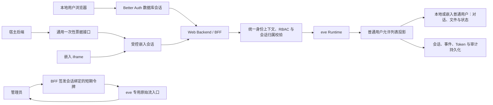

# 项目最终目标
1. 建立此agent项目的web管理面板，包括下列页面：
 - 登录页：
 在主页中提供本地用户与管理员共用的登录页面，使用用户名或邮箱加密码登录。浏览器不选择角色，登录后的页面和权限由服务端身份决定
 - 主页（用户可见、管理员可见）
 与agent的交互、对话，展示agent响应、回复以及操作过程，可选择不同agent进行交互（用户默认与主agent交互）
 - 模型管理页面（用户不可见、管理员可见）
 配置agent使用的模型，或分配不同agent所使用的模型
 设置模型提供商，允许从不同模型提供商或自定义模型提供商提供模型，并供给agent使用
 - 个人设置页面（用户可见、管理员可见）
 配置部分用户信息，包括个性化设置、会话产生的对用户记忆等
 - 用户管理页面（用户不可见、管理员可见）
 查看本地用户和嵌入用户；创建、启停和调整本地用户角色，重置本地用户密码并撤销会话；嵌入用户仅可查看和禁用
 - 嵌入接入页面（用户不可见、管理员可见）
 创建和管理通用嵌入客户端、精确允许的宿主 Origin 与客户端密钥轮换
 - agent管理页面（用户不可见、管理员可见）
 配置不同agent的提示词、能力、权限，添加或移除agent
 - Agent能力页面（用户不可见、管理员可见）
 管理主 Agent 当前启用的 Tool 与 Skill；变更形成不可变能力版本，并从下一 Turn 起生效
 - 系统管理页面（用户不可见、管理员可见）
管理整个项目的其他系统设置

2. 依据目标1，建立相关后端组件与接口

3. 本项目的 Agent 能力边界如下：
- 支持图片和 PDF 等受控会话附件；具体格式以模型能力声明和阶段设计为准
- 支持管理员按租户启停的动态 Tool，以及无需重新构建或重启即可创建、修改和启停的数据库 Markdown Skill
- 支持通过只读 Tool 接入外部知识库，并受控读取用户当前会话附件
- 支持主 Agent 使用 eve 原生 `agent` Tool 创建单层 Subagent；子 Agent 不可再次创建 Subagent
- P1 至 P10 不启用终端、Sandbox 或通用文件系统读写能力；这些能力不永久删除，但未来启用必须经过独立设计和安全评审

4. 在与agent的交互页面中，需要满足：
- 对用户，只显示agent与用户的基本交互内容（聊天对话、输入输出的文件），不暴露真实的工具调用、命令执行或其他任何显示agent如何决策的信息
- 对管理员，则显示出完全的agent执行路径信息，包括且不限于下述：
    - 当前展示 Tool 与 Subagent 的完整原始执行路径；未来若重新启用终端，再复用同一管理员原始事件与审计链路展示命令和输出
    - 当agent执行工具调用时，显示出调用了什么工具，调用工具填入的参数，工具返回的结果等
    - 当agent调度subagents时，提供进入subagents具体对话窗口的控件，显示subagent的完全执行路径信息
    - 当agent输出文本以外的内容（如图片、PDF、代码块等）需要对应进行渲染
- 显示上下文（tokens）tokens使用量。如果在配置模型时设置了（或是通过api端点接收到）最大上下文窗口（max content），也需要显示
- 显示同一会话内的用户信息节点，供用户跳转查看

5. 除了通过本项目自身的webUI交互外，需要支持将此项目交互页面嵌入到其他项目的网页中（提供与主agent进行交互的接口）

# 实施方案

## 技术选型

- Web：Next.js + `eve/next` + `eve/react`
- 数据库：PostgreSQL
- ORM：Drizzle
- 认证：Better Auth `1.6.25` + Drizzle Adapter，使用 PostgreSQL 数据库会话；密码使用 `@node-rs/argon2` `2.0.2` 的 Argon2id 哈希
- 会话附件：`BAIGONG_DATA_DIR/attachments` 本地持久化，PostgreSQL 保存归属和元数据；不使用外部对象存储或双副本缓存
- 外部知识源：由外部系统保存权威内容、索引和原始知识文件，本项目仅通过只读 Tool 接入
- 部署方式：Web 与 eve 同源部署
- 实时传输：普通用户通过 BFF 接收允许列表投影后的 eve NDJSON 事件；管理员使用会话绑定的短期令牌直连 eve 专用原始流入口
- 项目数据目录：遵循提交 `2655c3abe3839074c013b3a5d9a3f35b45ebe9d7` 确立的规则。WSL 开发可使用项目根目录 `.data`；生产 `BAIGONG_DATA_DIR` 必须为 Linux 原生文件系统上的绝对路径，并满足持久化、非 Web 公开、不进入 Git、应用用户独占及目录 `0700`/密钥文件 `0600` 权限要求

## 实施顺序

### P0：技术与安全边界定稿

明确前端、数据库、认证、部署和文件存储方案，定义角色权限、会话归属和事件可见性规则。

- 状态：已定稿
- 设计文件：[`docs/P0-技术与安全边界.md`](./P0-技术与安全边界.md)

### P1：应用骨架

建立 Next.js Web 应用并接入 eve，完成 Drizzle、PostgreSQL 迁移、环境配置、基础页面布局和统一错误处理。

- 状态：已完成
- 实施文件：[`docs/P1-应用骨架.md`](./P1-应用骨架.md)

### P2：登录与权限

实现本地普通用户和管理员登录、数据库会话、基于角色的访问控制、用户管理、会话所有权校验，以及与宿主无关的嵌入客户端、一次性票据和嵌入会话协议。

- 状态：已完成
- 实施与验收文件：[`docs/P2-登录与权限.md`](./P2-登录与权限.md)

### P3：安全对话主链路

实现会话创建、继续、取消和流式响应。普通用户只接收过滤后的消息事件，管理员可查看完整执行事件。

- 状态：已完成
- 验收备注：嵌入浏览器验收延期至 P9，异常状态浏览器矩阵延期至 P10；延期不改变 P3 已实现能力和安全边界。
- 设计文件：[`docs/P3-安全对话主链路.md`](./P3-安全对话主链路.md)

### P4：会话与审计持久化

实现会话列表、历史恢复、事件游标、Token 汇总、工具调用审计和 Subagent 子会话关联。

- 状态：已完成
- 验收备注：真实 Tool 和 Subagent 验收随 P5 执行；当前路线不启用终端，完整嵌入浏览器验收延期至 P9。
- 设计文件：[`docs/P4-会话与审计持久化.md`](./P4-会话与审计持久化.md)

### P5：Agent 基础能力

实现受控会话附件、模型多模态能力声明、可配置动态 Tools、数据库 Markdown Skills、主 Agent 单层 Subagents 和不可变 Agent 能力版本。`agent` 与 `ask_question` 固定开启，eve 原生 `web_search` 固定禁用；Tool 与 Skill 的动态变化从下一 Turn 生效。终端、Sandbox 和通用文件工具在当前 P1 至 P10 路线内保持禁用。

- 状态：方案已定稿
- 设计文件：[`docs/P5-Agent基础能力.md`](./P5-Agent基础能力.md)

### P6：外部知识源接入

通过统一只读 Tools/Knowledge Gateway 接入外部数据库、向量库、文件系统、对象存储、搜索服务或 API。本项目不建设本地知识上传、解析、分块、Embedding、索引或权威知识文件存储。

### P7：管理后台

实现模型提供商、模型分配、Agent 配置、提示词、能力权限、用户与嵌入接入的完整管理体验，以及系统设置。P2 已交付的最小用户与嵌入接入管理能力在本阶段扩展，不重复建立身份协议。

### P8：个人设置与记忆

实现用户资料、个性化设置、长期记忆查看与管理、记忆隔离和敏感信息策略。

### P9：嵌入能力

在 P2 通用嵌入认证协议之上，实现可复用嵌入聊天组件、完整协议文档和接入示例，不提供任何特定宿主系统的适配器。

### P10：质量与发布

完成 Evals、单元测试、集成测试、端到端测试、安全测试、限流、日志脱敏、备份恢复和部署文档。

P2 至 P4 组成首个可验收版本。该版本必须满足：

- 普通用户和管理员可登录。
- 经登记的宿主后端可通过通用协议为已认证外部用户创建短期嵌入会话，嵌入用户无需也不能使用本地登录。
- 普通用户可与主 Agent 持续对话。
- 普通用户无法从页面、接口响应或浏览器网络请求中取得工具参数、工具结果、终端详情、推理信息、Subagent 原始事件和内部标识；用户可以查看自己主会话派生的 Subagent 安全对话，但原始委派完成后子会话始终只读。
- 管理员可查看工具输入输出、Token 使用量和子会话入口；未来若启用终端，同一原始事件链路也承载命令详情。
- 用户不能读取、继续或取消其他用户的会话。
- 页面刷新后可恢复会话和流式事件游标。

## 主链路

## 实现原则

1. 普通用户不得直接访问 eve 原始事件流。隐藏工具、推理和 Subagent 信息必须在服务端事件投影层完成，不得仅依赖前端隐藏。
2. 所有会话创建、继续、取消、流读取和历史查询都必须执行会话所有权校验。
3. 事件投影必须采用显式允许列表。普通用户仅获得产品定义中允许的消息、文件和状态数据。
4. 模型、提示词和能力权限可存入数据库，并通过 eve 动态解析器按会话加载。
5. Agent 类型、Tool 和 Subagent 结构以代码和文件系统为权威来源；Markdown Skill 以 PostgreSQL 中的不可变版本为权威来源。管理页面不得修改生产环境源码，Skill 内容也不得携带脚本或扩大 Tool 权限。
6. 模型提供商密钥必须加密存储，不得返回浏览器、写入日志或进入 Agent Prompt。
7. 用户、租户、会话、文件、记忆和凭据的访问范围必须由已验证的身份上下文决定，不得接受模型输入的用户 ID 或租户 ID 作为授权依据。
8. 长期用户记忆使用应用数据库或向量存储，不使用仅属于单个 eve 会话的状态代替。
9. 用户会话附件由本项目本地持久化并保留明确的租户、所有者、会话和消息关联；外部知识内容、索引及原始知识文件由外部知识源负责，本项目不复制为本地知识库。
10. 每个阶段都必须先完成对应的构建、类型检查、自动化测试和验收标准，再进入后续阶段。
11. 本地用户与嵌入用户是永久隔离的身份来源，不得合并、绑定、转换，也不得按用户名、邮箱或显示名称自动关联。
12. 嵌入能力必须保持宿主无关。本项目不得读取或依赖任何特定宿主的 IAM、数据库、角色模型或内部接口，也不修改宿主项目；宿主自行适配本项目公开协议。
13. 主 Agent 与 Subagent 使用统一会话、消息、Turn、游标和权限模型。用户只能访问自己会话派生的 Subagent 安全投影；完整子会话执行历史仍只对管理员开放。
14. 客户端提交的内部用户 ID、租户或角色不得作为授权依据。嵌入身份只能映射为本项目普通用户，不能取得管理员权限。
15. 当前 P1 至 P10 路线必须通过 `disableTool()` 持续移除 `bash`、`read_file`、`write_file`、`glob` 和 `grep`。未来恢复终端、Sandbox 或通用文件能力时，必须先完成新的威胁建模、权限设计和安全验收。
