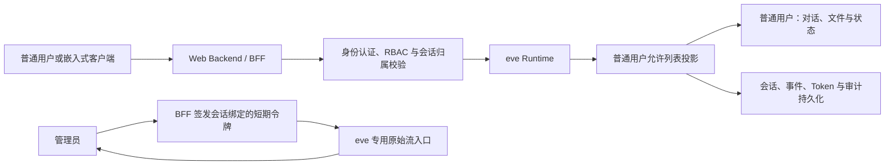

# 项目最终目标
1. 建立此agent项目的web管理面板，包括下列页面：
 - 登录页：
 在主页中，具备基本的用户登录页面，包括普通用户登录和admin管理员登录。不同身份登录展示的后续页面存在差异
 - 主页（用户可见、管理员可见）
 与agent的交互、对话，展示agent响应、回复以及操作过程，可选择不同agent进行交互（用户默认与主agent交互）
 - 模型管理页面（用户不可见、管理员可见）
 配置agent使用的模型，或分配不同agent所使用的模型
 设置模型提供商，允许从不同模型提供商或自定义模型提供商提供模型，并供给agent使用
 - 个人设置页面（用户可见、管理员可见）
 配置部分用户信息，包括个性化设置、会话产生的对用户记忆等
 - 用户管理页面（用户不可见、管理员可见）
 查看并管理登录的用户，可设置用户信息、重置用户密码等
 - agent管理页面（用户不可见、管理员可见）
 配置不同agent的提示词、能力、权限，添加或移除agent
 - 系统管理页面（用户不可见、管理员可见）
管理整个项目的其他系统设置

2. 依据目标1，建立相关后端组件与接口

3. 本项目的所有agent至少需要具备以下能力：
- 多模态输入、读取（PDF、WORD、IMAGES等）
- 工具调用
- skill能力
- 终端操作能力
- Subagents调用（此能力仅主agent拥有，由主agent产生的子agent不可再次产生subagents）
- 文件调用（例如从知识库中调取原文文档发送给用户）

4. 在与agent的交互页面中，需要满足：
- 对用户，只显示agent与用户的基本交互内容（聊天对话、输入输出的文件），不暴露真实的工具调用、命令执行或其他任何显示agent如何决策的信息
- 对管理员，则显示出完全的agent执行路径信息，包括且不限于下述：
    - 当agent执行终端操作时，需要显示模型执行的具体命令以及命令输出（假如输出过长则截断显示，并提供完全显示的可点击控件）
    - 当agent执行工具调用时，显示出调用了什么工具，调用工具填入的参数，工具返回的结果等
    - 当agent调度subagents时，提供进入subagents具体对话窗口的控件，显示subagent的完全执行路径信息
    - 当agent输出文本以外的内容（如图片、PDF、代码块等）需要对应进行渲染
- 显示上下文（tokens）tokens使用量。如果在配置模型时设置了（或是通过api端点接收到）最大上下文窗口（max content），也需要显示
- 显示同一会话内的用户信息节点，供用户跳转查看

5. 除了通过本项目自身的webUI交互外，需要支持将此项目交互页面嵌入到其他项目的网页中（提供与主agent进行交互的接口）

# 实施方案

## 技术选型

- Web：Next.js + `eve/next` + `eve/react`
- 数据库：PostgreSQL
- ORM：Drizzle
- 认证：Auth.js，使用数据库会话
- 文件存储：S3 兼容对象存储
- 部署方式：Web 与 eve 同源部署
- 实时传输：普通用户通过 BFF 接收允许列表投影后的 eve NDJSON 事件；管理员使用会话绑定的短期令牌直连 eve 专用原始流入口

## 实施顺序

### P0：技术与安全边界定稿

明确前端、数据库、认证、部署和文件存储方案，定义角色权限、会话归属和事件可见性规则。

- 状态：已定稿
- 设计文件：[`docs/P0-技术与安全边界.md`](./P0-技术与安全边界.md)

### P1：应用骨架

建立 Next.js Web 应用并接入 eve，完成 Drizzle、PostgreSQL 迁移、环境配置、基础页面布局和统一错误处理。

### P2：登录与权限

实现普通用户和管理员登录、基于角色的访问控制、用户管理基础接口和会话所有权校验。

### P3：安全对话主链路

实现会话创建、继续、取消和流式响应。普通用户只接收过滤后的消息事件，管理员可查看完整执行事件。

### P4：会话与审计持久化

实现会话列表、历史恢复、事件游标、Token 汇总、工具调用审计和 Subagent 子会话关联。

### P5：Agent 基础能力

实现多模态文件输入、Sandbox 终端、文件读写、Tools、Skills 和主 Agent 单层 Subagents。

### P6：文件与知识库

实现文件上传、对象存储、文档解析、知识库检索和原始文件受控下载。

### P7：管理后台

实现模型提供商、模型分配、Agent 配置、提示词、能力权限、用户管理和系统设置。

### P8：个人设置与记忆

实现用户资料、个性化设置、长期记忆查看与管理、记忆隔离和敏感信息策略。

### P9：嵌入能力

实现可嵌入聊天组件、短期授权令牌、来源域限制和主 Agent 外部交互接口。

### P10：质量与发布

完成 Evals、单元测试、集成测试、端到端测试、安全测试、限流、日志脱敏、备份恢复和部署文档。

P2 至 P4 组成首个可验收版本。该版本必须满足：

- 普通用户和管理员可登录。
- 普通用户可与主 Agent 持续对话。
- 普通用户无法从页面、接口响应或浏览器网络请求中取得工具参数、工具结果、推理信息和 Subagent 详情。
- 管理员可查看命令、工具输入输出、Token 使用量和子会话入口。
- 用户不能读取、继续或取消其他用户的会话。
- 页面刷新后可恢复会话和流式事件游标。

## 主链路

## 实现原则

1. 普通用户不得直接访问 eve 原始事件流。隐藏工具、推理和 Subagent 信息必须在服务端事件投影层完成，不得仅依赖前端隐藏。
2. 所有会话创建、继续、取消、流读取和历史查询都必须执行会话所有权校验。
3. 事件投影必须采用显式允许列表。普通用户仅获得产品定义中允许的消息、文件和状态数据。
4. 模型、提示词和能力权限可存入数据库，并通过 eve 动态解析器按会话加载。
5. Agent 类型、Tool、Skill 和 Subagent 结构以代码和文件系统为权威来源。新增或移除这些结构必须经过构建、校验和部署，管理页面不得直接修改生产环境源码。
6. 模型提供商密钥必须加密存储，不得返回浏览器、写入日志或进入 Agent Prompt。
7. 用户、租户、会话、文件、记忆和凭据的访问范围必须由已验证的身份上下文决定，不得接受模型输入的用户 ID 或租户 ID 作为授权依据。
8. 长期用户记忆使用应用数据库或向量存储，不使用仅属于单个 eve 会话的状态代替。
9. 文件原文、解析结果和知识库索引必须保留明确的所有者、访问权限和源文件关联。
10. 每个阶段都必须先完成对应的构建、类型检查、自动化测试和验收标准，再进入后续阶段。
